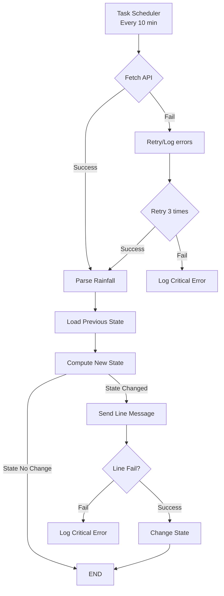

### Weatherbot
Query rainfall data by weather API, sent Line messages if status is changed.

```mermaid
graph TD
    A[Task Scheduler<br>Every 10 min] --> B{Fetch API}
    B -- Success --> C[Parse Rainfall]
    B -- Fail --> D[Retry/Log errors]
    D --> E{Retry 3 times}
    E -- Success --> C
    E -- Fail --> G[Log Critical Error]
    C --> F[Load Previous State]
    F --> H[Compute New State]
    H -- State Changed --> I[Send Line Message]
    H -- State No Change --> Z[END]
    I --> J{Line Fail?}
    J -- Success --> L[Change State]
    J -- Fail --> K[Log Critical Error]
    L --> Z
```