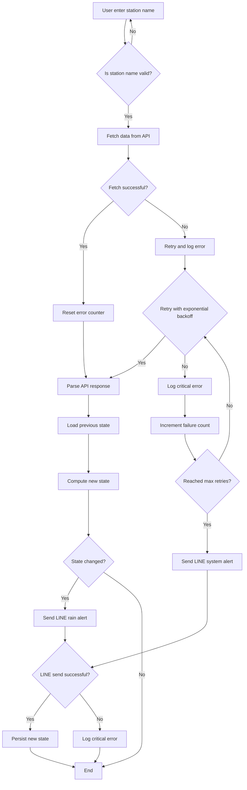

### Weatherbot
Query rainfall data by weather API, sent Line messages if status is changed.

This program parses weather API data and use Line message to notify user the weather state is changed significantly.

User enter station name:
    - Ask user to input valid station name if station name isn't exist or invalid.
Fetch data from API:
    - If station name is valid, fetch weather data though API.

There are two conditions while querying API.
If fail, we have to retry, implement "exponential backoff algorithm" and jitter to retry.
    - fail count increase, once reach to maximum value, stop retry.
        - once reach maximum fail count, send out line message to notify user "api service is unavailable now"
    - every retry should keep results as log.
    - once success, reset fail count to 0.
If success, proceed and reset fail count to 0.

Start parsing weather API data, and compare it with previous state.
    - if it is the first request, no comparison.
    - if state changed, send line message to notify user "the weather is changed"
    - according to the level of change, defind "light" or "heavy" rain.
    - if line message fail to send out message, log critical error, send out email "Line message failed"

End of the process