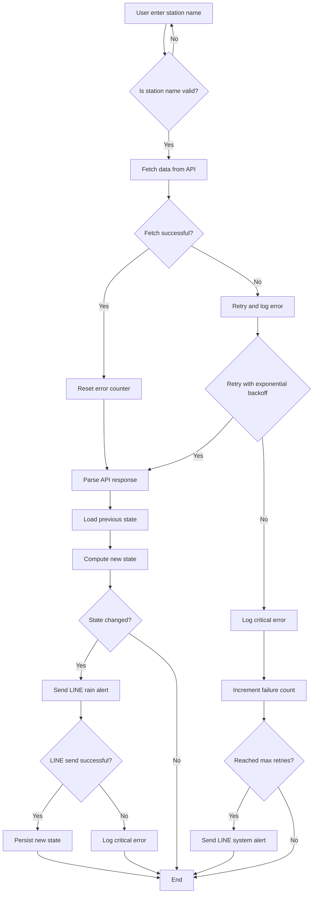

### Weatherbot
Query rainfall data by weather API, sent Line messages if status is changed.

This program parses weather API data and use Line message to notify user the weather state is changed significantly.

User enter station name:
    - search weather station, start parsing weather data.
    - if station didn't exist, ask user to input valid station name.
Fetch data from API:
    - 
